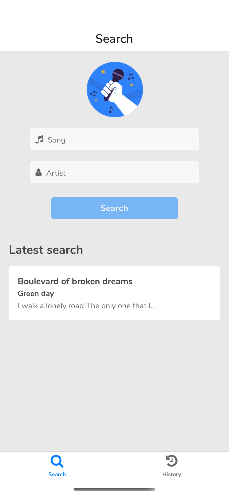
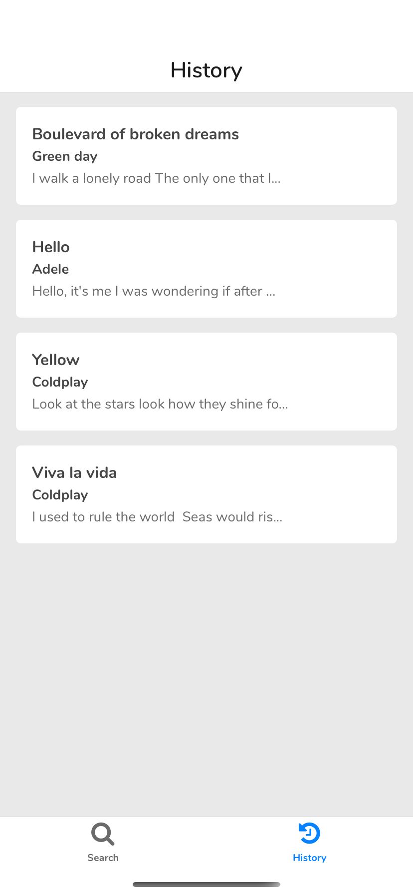
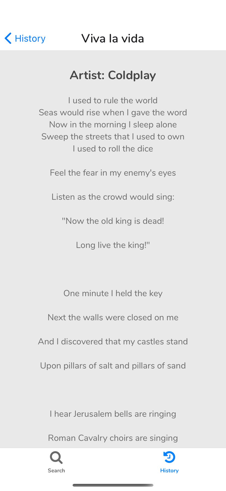
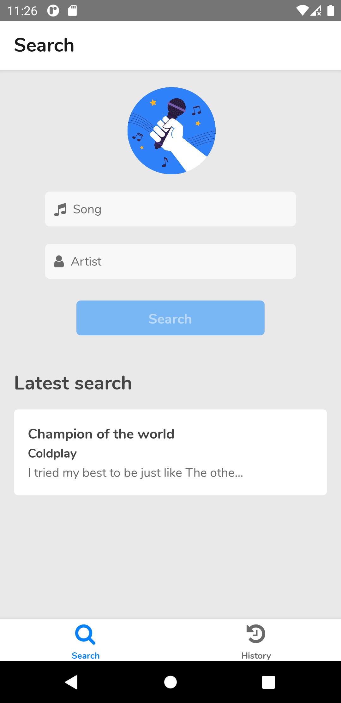
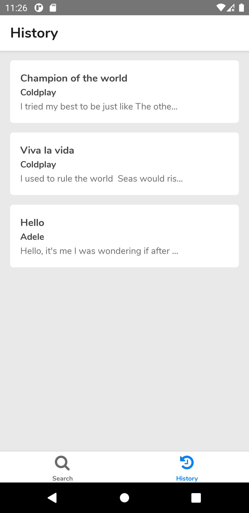
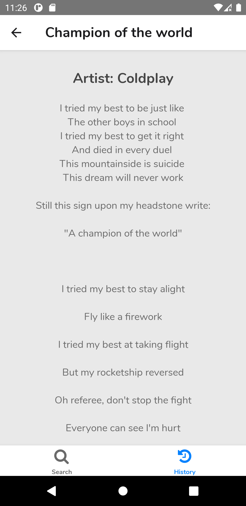

    

# Lyrics Hunter

Lyrics hunter is an app that allows you to search lyrics just by typing the song name and its artist, it saves your latest search and show it to you below the form in case you want to return to it even without internet connection. There's a history section that will save every search that you have successfully made. 

Built using React Native, so it's available to use on both Android and iOS.

Lyrics Hunter app fetches the lyrics data from the following [API](https://lyricsovh.docs.apiary.io/).

## Preview

### iOS

    
    
    

### Android

    
    
    

## Before you begin
Please make sure you are using the required [tools](https://github.com/JosePBrotons/mobile-dev-tools) before checking this app.

## Available Arguments

### {platform_os}:
- Android.
- iOS.

### {env}:

- st: Staging environment.

- pr: Production environment.

## Installation
To start checking this project please proceed with the scripts bellow:

    $ git clone git@github.com:JosePBrotons/lyrics-hunter.git
    $ yarn install
----

## Run the app
To start running the app in debug mode first make sure you start the metro bundler by running this script:

    $ yarn start

Then execute the following script:

Android: 

    $ yarn android:build env:{environment}
    
iOS: 

    $ yarn ios:build env:{environment}

Thanks
------

**Jose Brotons** © 2020

> GitHub [@josepbrotons](https://github.com/JosePBrotons)
